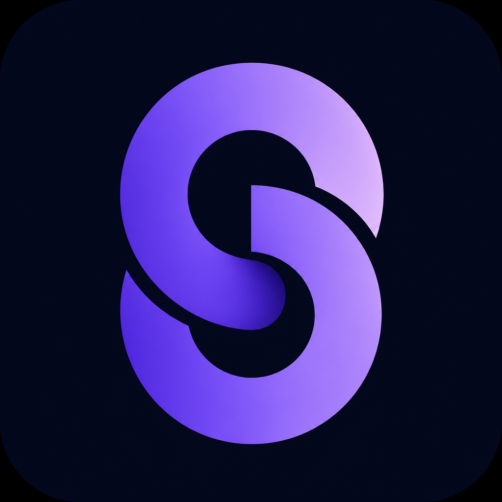
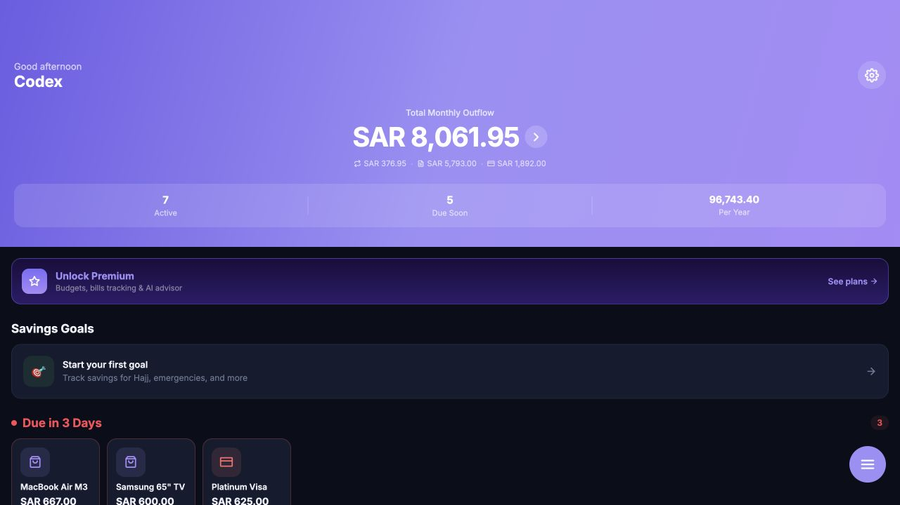
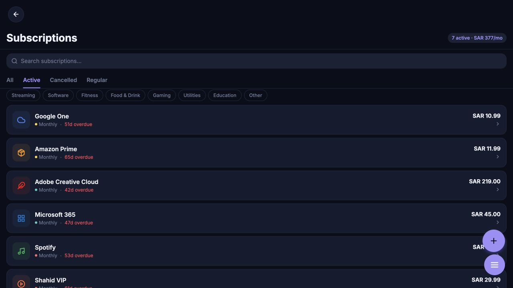
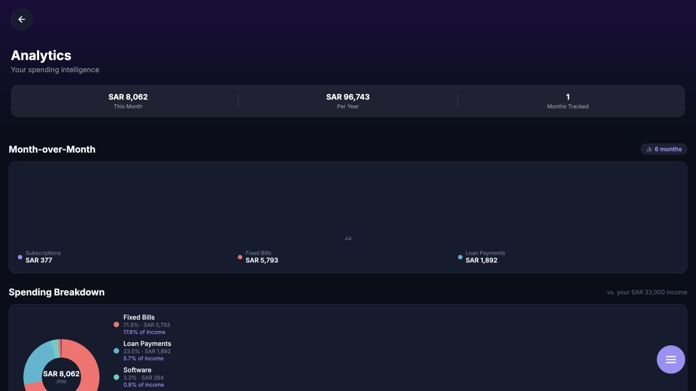

<div align="center">
  
  <h1>SubTrack</h1>
  <p><strong>Your subscriptions, bills, and financial goals in one place.</strong></p>
  <p>A personal finance app built around Saudi Riyal spending, with Arabic and English support.</p>
  <p><a href="https://subtrack-budget.replit.app/">Open the live app</a> · <a href="docs/README.md">Explore the documentation</a> · <a href="#run-locally">Run locally</a></p>
</div>



## A clearer view of your money

SubTrack brings recurring payments and savings planning into a single Expo / React Native app, with a web experience available through the live link above.

- **Dashboard:** monthly outflow, upcoming payments, and spending categories.
- **Subscriptions:** searchable recurring services, category filters, and renewal tracking.
- **Bills and loans:** recurring expenses, credit cards, and buy-now-pay-later tracking.
- **Analytics:** spending breakdowns, monthly snapshots, and savings-rate views.
- **Planning:** savings goals and category budgets.
- **Personalization:** Arabic / English, RTL layouts, and appearance settings.

Some features require Premium or additional service configuration. Bank-linking flows currently include simulated behavior; see the [bank connections documentation](docs/features/banks.md).

## Screenshots

Captured from the [live web app](https://subtrack-budget.replit.app/) on September 21, 2026. These are actual interface captures; figures and availability reflect the session shown. The deployed app may differ from this source snapshot.

### Subscription management

Search services, filter categories, and see recurring costs at a glance.



### Spending analytics

Review monthly outflow and the split between subscriptions, fixed bills, and loan payments.



## Built with

| Layer | Technology |
| --- | --- |
| App | Expo, React Native, Expo Router, TypeScript |
| API | Node.js, Express |
| Database | PostgreSQL, Drizzle ORM |
| Workspace | pnpm |
| AI integration | OpenAI-compatible integration configured through environment variables |

## Run locally

Clone the repository, then install dependencies:

```bash
git clone https://github.com/MohammedSAlsaleh/subtrack.git
cd subtrack
corepack enable
pnpm install
```

For local Expo development, configure `EXPO_PUBLIC_API_URL` to an API URL reachable from your device, then run:

```bash
pnpm --filter @workspace/mobile exec expo start --port 8081
```

In another terminal, configure the API environment and start it:

```bash
pnpm --filter @workspace/api-server run dev
```

The API requires `PORT`, `DATABASE_URL`, `SESSION_SECRET`, `AI_INTEGRATIONS_OPENAI_BASE_URL`, and `AI_INTEGRATIONS_OPENAI_API_KEY`, plus database schema setup. Keep secret values outside Git. Set these variables in the API process environment; the scripts do not automatically guarantee loading an `.env` file. The mobile `dev` script assumes Replit, so use the Expo command above for local development.

## Repository map

```text
artifacts/mobile/           Mobile app and Expo web experience
artifacts/api-server/       Express API
artifacts/subtrack-deck/    Product presentation
artifacts/subtrack-guide/   Product walkthrough
artifacts/mockup-sandbox/   Component previews
lib/                       Shared database, API, and integration packages
docs/                      Feature documentation and screenshots
scripts/                   Supporting scripts
```

## Learn more

- [Feature and screen documentation](docs/README.md)
- [API reference](docs/api/README.md)
- [Authentication](docs/authentication.md)
- [Localization](docs/localization.md)
